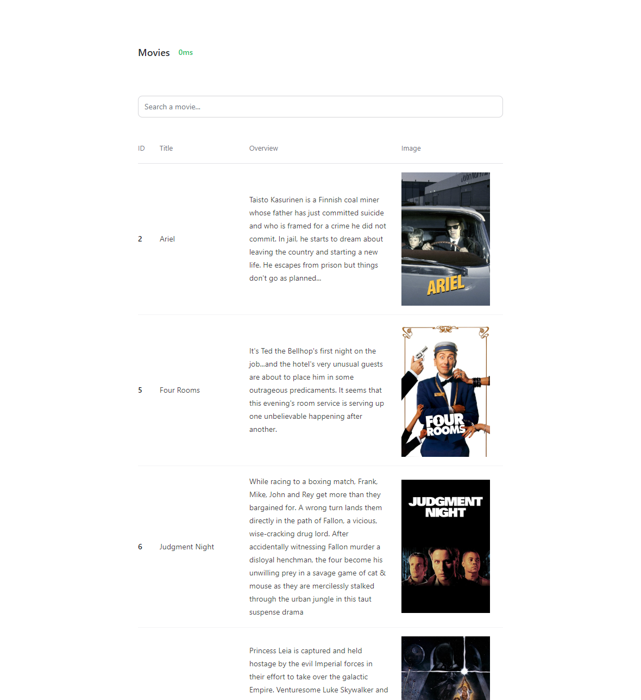

# Movies

A simple project that demonstrates how to use MeiliSearch and Phoenix to build a blazing-fast search engine.

## Example



## Features

- Search movies
- See the processing time of the search
- Infinite scroll

## Technologies

- [Phoenix 1.7](https://www.phoenixframework.org/)
- [MeiliSearch 1.0](https://www.meilisearch.com/)

## Setup

- Pull the latest version of the `meilisearch` image

```sh
> docker pull getmeili/meilisearch:v1.0
```

- Create a new `meilisearch` instance

```sh
> docker run -it --name meilisearch -p 7700:7700 -e MEILI_ENV=development -v $HOME/docker/volumes/meili_data:/meili_data getmeili/meilisearch:v1.0
```

- Add the `data/movies.json` dataset to the `meilisearch` instance

```sh
> curl -X POST 'http://localhost:7700/indexes/movies/documents?primaryKey=id' -H 'Content-Type: application/json' --data-binary @data/movies.json
```

- Start the web application

```sh
> cd movies

> mix setup

> mix phx.server
```

- Visit [`localhost:4000`](http://localhost:4000) from your browser.

- Enjoy!
